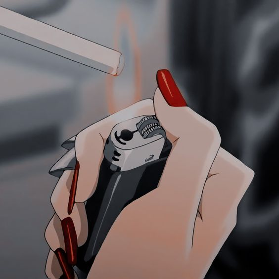

<!-- PROJECT LOGO -->
 

  

   <h3 align="center">EmbedSender</h3>

  

    Costume Embed Discord Js Embed Sender
     
    <a href="https://github.com/MaxgamingDev/MG-EmbedSender"><strong>Explore the docs »</strong></a>
     
     
    <a href="https://github.com/MaxgamingDev/MG-EmbedSender">View Demo</a>
    ·
    <a href="https://github.com/MaxgamingDev/MG-EmbedSender/issues">Report Bug</a>
    ·
    <a href="https://github.com/MaxgamingDev/MG-EmbedSender/issues">Request Feature</a>
  

